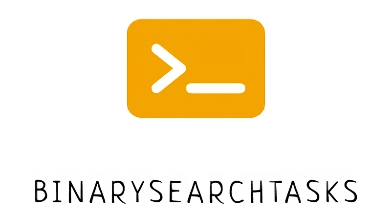

# BinarySearchSolving

**В этом репозитории представлены решения задач на тему "Бинарный поиск".**

Ссылка на контест - [YandexContest](https://contest.yandex.ru/contest/70269/enter/?retPage=).

## Установка

Чтобы установить BinarySearchSolving, выполните следующие шаги:
1. Склонируйте репозиторий на вашу машину:
```console
git clone https://github.com/UnityDuck/BinarySearchTasks.git
```
2. Перейдите в директорию проекта:
```console
cd BinarySearchSolving
```

## Собственный вклад в развитие проекта

Если вы хотите внести свой вклад в проект или предложить более эффективный способ решения задачи, сделайте следующее:

1. Форкните репозиторий.
2. Создайте ветку.
```console
git checkout -b feature-name
```
3. Внесите изменения и коммитьте их.
```console
git commit -m '{what_have_you_done}'
```
4. Отправьте вашу ветку.
```console
git push origin feature-name
```
5. Откройте Pull Request.

## Лицензия

Этот проект лицензирован на условиях MIT License. С подробностями можете ознакомиться в файле LICENSE.

## Контакты

Если у вас есть вопросы или предложения, вы можете обратиться через surovov1@yandex.ru.

С нетерпением жду ваших идей и предложений по более эффективным решениям тех или иных задач из контеста! Спасибо за интерес к BinarySearchTasks!

